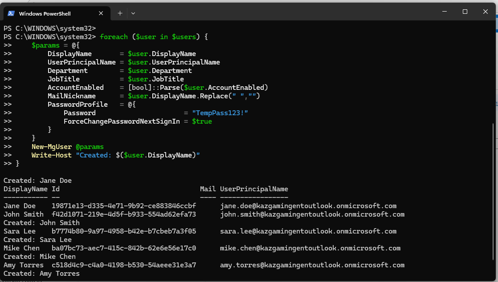
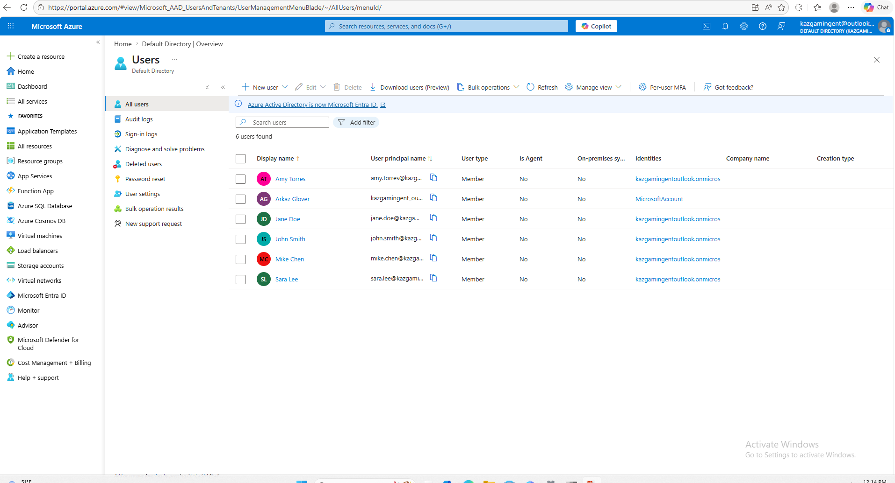
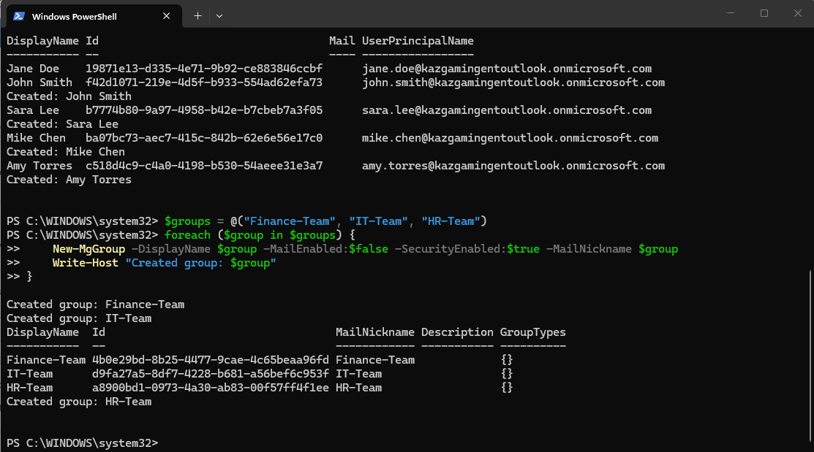
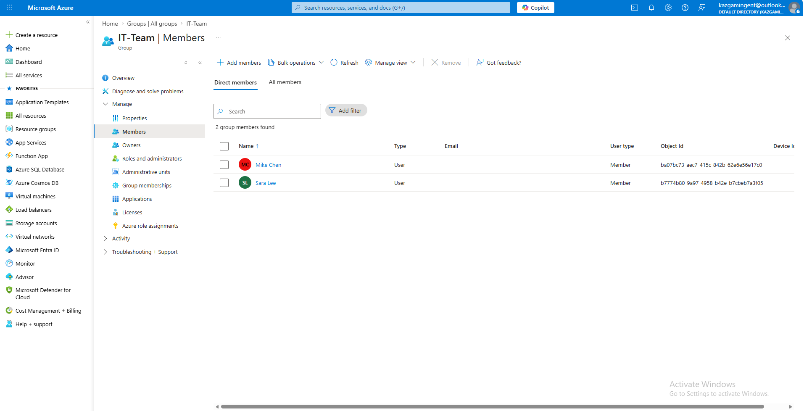
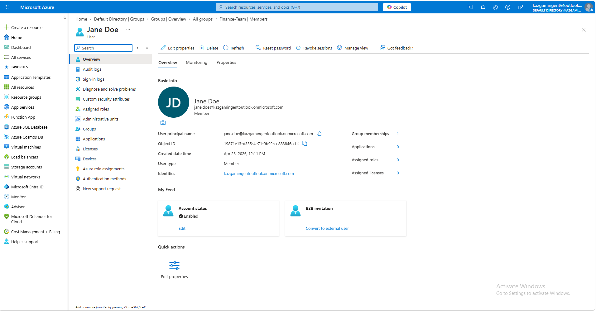
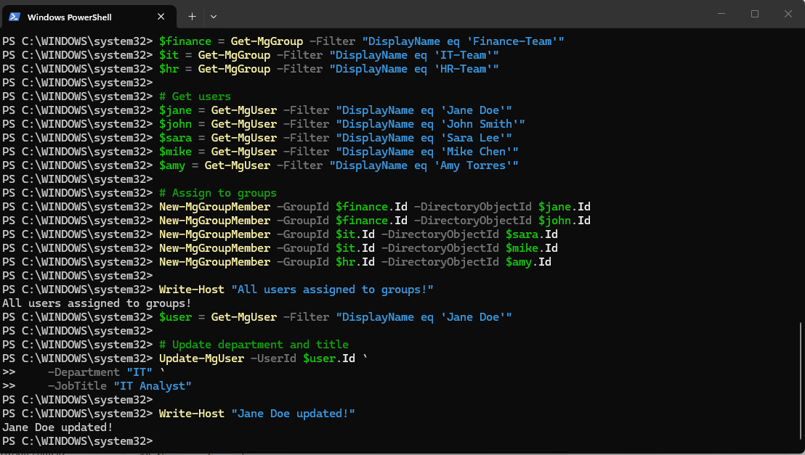
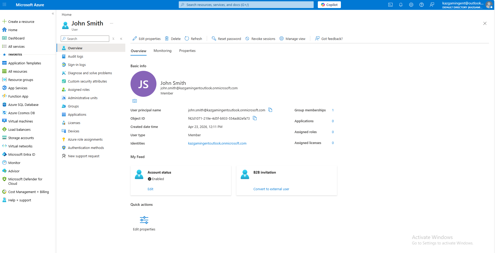
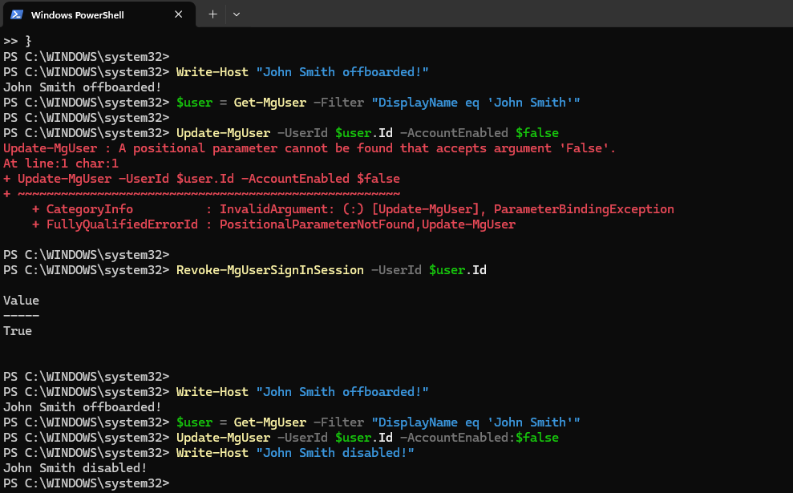
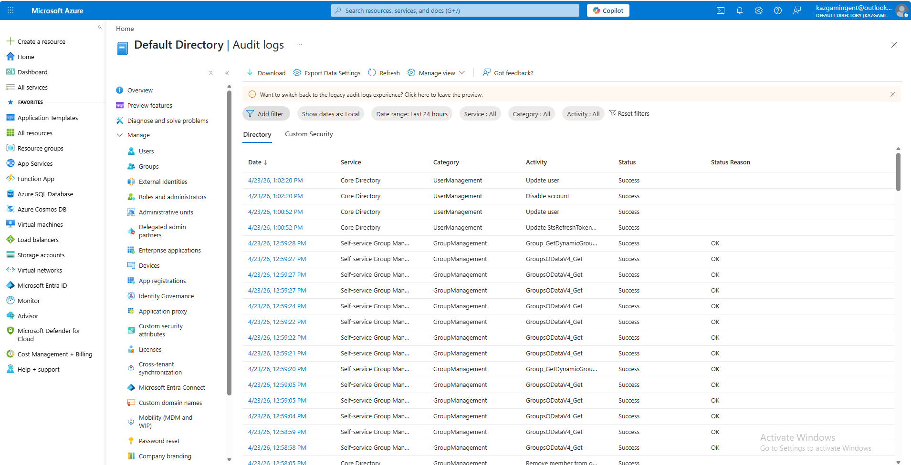
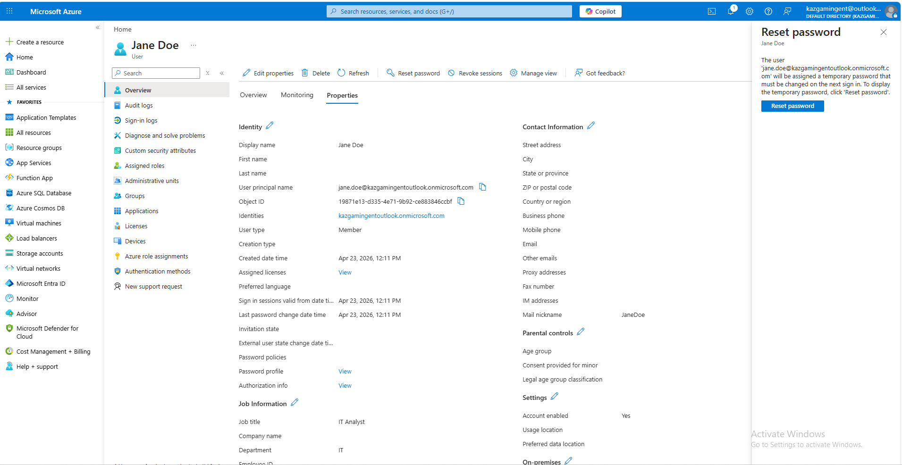

# Project 5 – IAM Identity Lifecycle Management in Microsoft Entra ID with PowerShell


---

## Overview

This project demonstrates a complete Identity and Access Management lifecycle in **Microsoft Entra ID** using the **Microsoft Graph PowerShell SDK**. Five fictional employees were provisioned from a CSV file, assigned to department security groups, updated through role changes, and offboarded through account disabling and session revocation. All actions were captured in Entra audit logs, mirroring the Joiner-Mover-Leaver framework used in real enterprise IAM operations.

---

## Environment

| Tool | Purpose |
|------|---------|
| Microsoft Azure Portal | Cloud identity management platform |
| Microsoft Entra ID (Free Tier) | Identity provider and directory |
| Microsoft Graph PowerShell SDK | Automated user provisioning and lifecycle management |
| PowerShell | Scripting and command execution |
| GitHub | Documentation and version control |

---

## Identity Lifecycle Design

### User Roster

| Display Name | Department | Group |
|-------------|-----------|-------|
| Jane Doe | IT | IT-Team |
| John Smith | Finance | Finance-Team |
| Sara Lee | IT | IT-Team |
| Mike Chen | Finance | Finance-Team |
| Amy Torres | HR | HR-Team |

### Security Groups

| Group | Department |
|-------|-----------|
| Finance-Team | Finance / HR |
| IT-Team | Admin / IT |
| HR-Team | Human Resources |

---

## Build Walkthrough

---

### 🟡 Step 1 — Provisioned Users from CSV via PowerShell (Joiner)

Connected to Microsoft Graph with `User.ReadWrite.All` and `Group.ReadWrite.All` scopes. Imported a CSV containing DisplayName, UserPrincipalName, Department, JobTitle, and AccountEnabled for five employees. Used a `foreach` loop with `New-MgUser` to provision all five accounts. Each user received a temporary password of `TempPass123!` with `ForceChangePasswordNextSignIn` set to true. All five users were created and confirmed in the terminal output.

**Commands Used:**
```powershell
Connect-MgGraph -Scopes 'User.ReadWrite.All','Group.ReadWrite.All'
$users = Import-Csv "users.csv"
foreach ($user in $users) {
    $params = @{
        DisplayName           = $user.DisplayName
        UserPrincipalName     = $user.UserPrincipalName
        Department            = $user.Department
        JobTitle              = $user.JobTitle
        AccountEnabled        = [bool]::Parse($user.AccountEnabled)
        MailNickname          = $user.DisplayName.Replace(" ","")
        PasswordProfile       = @{
            Password                      = "TempPass123!"
            ForceChangePasswordNextSignIn = $true
        }
    }
    New-MgUser @params
    Write-Host "Created: $($user.DisplayName)"
}
```


*PowerShell output — all five users created via New-MgUser with UPNs confirmed*

---

### 🔵 Step 2 — Verified Users in Microsoft Entra Portal

Navigated to the Azure Portal and confirmed all five provisioned users appeared in the Entra ID All Users blade. Six total users shown — five provisioned accounts plus the admin account (Arkaz Glover).


*Entra ID All Users — Jane Doe, John Smith, Sara Lee, Mike Chen, Amy Torres confirmed as Members*

---

### 🔵 Step 3 — Created Security Groups and Assigned Users (Joiner)

Created three security groups — Finance-Team, IT-Team, and HR-Team — using a `foreach` loop with `New-MgGroup`. Retrieved each user and group by display name using `Get-MgUser` and `Get-MgGroup`, then assigned users to their department groups using `New-MgGroupMember`.

**Commands Used:**
```powershell
$groups = @("Finance-Team", "IT-Team", "HR-Team")
foreach ($group in $groups) {
    New-MgGroup -DisplayName $group -MailEnabled:$false -SecurityEnabled:$true -MailNickname $group
}

$finance = Get-MgGroup -Filter "DisplayName eq 'Finance-Team'"
$it      = Get-MgGroup -Filter "DisplayName eq 'IT-Team'"
$hr      = Get-MgGroup -Filter "DisplayName eq 'HR-Team'"

New-MgGroupMember -GroupId $finance.Id -DirectoryObjectId $jane.Id
New-MgGroupMember -GroupId $finance.Id -DirectoryObjectId $john.Id
New-MgGroupMember -GroupId $it.Id      -DirectoryObjectId $sara.Id
New-MgGroupMember -GroupId $it.Id      -DirectoryObjectId $mike.Id
New-MgGroupMember -GroupId $hr.Id      -DirectoryObjectId $amy.Id
Write-Host "All users assigned to groups!"
```


*PowerShell output — Finance-Team, IT-Team, and HR-Team created with Object IDs confirmed*

---

### 🟠 Step 4 — Verified Group Membership in Entra Portal

Navigated to IT-Team group in the Entra portal and confirmed members. Mike Chen and Sara Lee appeared as direct members with their Object IDs matching the PowerShell output.


*IT-Team Members blade — Mike Chen and Sara Lee confirmed as direct members*

---

### 🟠 Step 5 — Updated User Profile and Group (Mover)

Simulated an employee role change for Jane Doe. Updated her Department to IT and JobTitle to IT Analyst using `Update-MgUser`. Then assigned users to their correct groups and confirmed the update with a `Write-Host` confirmation.

**Commands Used:**
```powershell
$user = Get-MgUser -Filter "DisplayName eq 'Jane Doe'"
Update-MgUser -UserId $user.Id `
    -Department "IT" `
    -JobTitle "IT Analyst"
Write-Host "Jane Doe updated!"
```


*PowerShell — group assignments completed and Jane Doe's department and job title updated*

---

### 🟣 Step 6 — Verified Jane Doe Profile in Entra Portal (Before)

Confirmed Jane Doe's user profile in the Entra portal before offboarding. Account status shows Enabled, group memberships at 1, UPN and Object ID visible.


*Jane Doe user profile — Account Enabled, 1 group membership confirmed before offboarding*

---

### 🟣 Step 7 — Verified Jane Doe Properties — Department and Job Title Updated

Navigated to Jane Doe's Properties tab and confirmed Job Title updated to IT Analyst and Department updated to IT. Reset password panel visible confirming temporary password policy in place.


*Jane Doe Properties — Job Title: IT Analyst, Department: IT confirmed after Mover update*

---

### 🔴 Step 8 — Disabled Account and Revoked Sessions (Leaver)

Simulated offboarding for John Smith. Disabled his account using `Update-MgUser -AccountEnabled:$false` and revoked all active sign-in sessions using `Revoke-MgUserSignInSession`. Initial attempt with `-AccountEnabled $false` returned a parameter binding error — corrected to `-AccountEnabled:$false` which executed successfully.

**Commands Used:**
```powershell
$user = Get-MgUser -Filter "DisplayName eq 'John Smith'"
Update-MgUser -UserId $user.Id -AccountEnabled:$false
Revoke-MgUserSignInSession -UserId $user.Id
Write-Host "John Smith disabled!"
```


*PowerShell — account disabled and sessions revoked for John Smith. Parameter binding error shown and corrected — correct syntax is -AccountEnabled:$false*

---

### 🔴 Step 9 — Verified John Smith Account Disabled in Entra Portal

Confirmed John Smith's account status in the Entra portal. Account status shows Disabled and group memberships show 0 — all access removed. UPN and Object ID visible for audit trail.


*John Smith user profile — Account Disabled, Group memberships: 0 confirmed after Leaver offboarding*

---

### 🔴 Step 10 — Verified John Smith Profile Before Disable

Confirmed John Smith's active profile state before offboarding for comparison. Account status Enabled, 1 group membership active.


*John Smith user profile — Account Enabled, 1 group membership confirmed before offboarding*

---

### ✅ Step 11 — Reviewed Audit Logs in Entra Portal

Navigated to Entra ID > Monitoring > Audit Logs and filtered by the last 24 hours. Logs confirmed all lifecycle events: user updates, account disable, session token revocation (Update StsRefreshToken), and group membership changes — all with Success status.


*Entra Audit Logs — UserManagement and GroupManagement events including Disable account and Update StsRefreshToken all logged with Success status*

---

## Final Summary

| Lifecycle Phase | Action | Cmdlet Used |
|----------------|--------|------------|
| Joiner | Provisioned 5 users from CSV | New-MgUser |
| Joiner | Created 3 security groups | New-MgGroup |
| Joiner | Assigned users to department groups | New-MgGroupMember |
| Mover | Updated department and job title | Update-MgUser |
| Mover | Moved user to new group | New-MgGroupMember |
| Leaver | Disabled account | Update-MgUser -AccountEnabled:$false |
| Leaver | Revoked active sessions | Revoke-MgUserSignInSession |
| Audit | Reviewed all events in audit log | Entra Portal |

---

## Skills Demonstrated

| Skill | How It Was Applied |
|-------|--------------------|
| User Provisioning | Bulk-created users from CSV using New-MgUser |
| Group Management | Created security groups and assigned members via PowerShell |
| Identity Lifecycle | Executed full Joiner-Mover-Leaver workflow end to end |
| Account Offboarding | Disabled accounts and revoked sessions on departure |
| Audit Log Review | Confirmed all events captured in Entra audit logs |
| PowerShell Scripting | Automated all operations via Microsoft Graph SDK |
| Error Troubleshooting | Identified and corrected parameter binding syntax error live |
| Microsoft Entra ID | Navigated portal to verify all changes post-execution |

---

## Lessons Learned

**Unrevoked access is the most exploited gap in enterprise security.** The Leaver scenario is not just an HR process — it is a direct attack surface. Accounts that remain enabled after offboarding are one of the most common vectors for insider threats and credential-based attacks. Automating disable and session revocation with `Revoke-MgUserSignInSession` ensures that even if a departing employee still has their credentials, their active tokens are immediately invalidated.

**Audit logs are not optional — they are your proof of work.** Every provisioning, update, and disable action was captured in the Entra audit log with a timestamp, category, and success status. In a real environment, these logs feed into SIEM platforms like Microsoft Sentinel for alerting and compliance reporting. Being able to navigate and read audit logs is as important as knowing how to run the commands.

**Syntax errors in production have consequences.** The parameter binding error on `-AccountEnabled $false` vs `-AccountEnabled:$false` is a real distinction in PowerShell's Graph SDK. In a live environment, a failed disable command on a departing employee's account could leave that account active for hours or days. Catching it, understanding why it failed, and correcting it immediately is exactly what an IAM analyst is expected to do.

---

## Real-World Application

IAM analysts run Joiner-Mover-Leaver workflows every single day. When an employee joins, their accounts must be provisioned and access granted based on role. When they transfer departments, access must be updated — not just added. When they leave, every token, session, and group membership must be revoked immediately. Organizations that fail to automate this process face compliance violations under frameworks like SOC 2, ISO 27001, and NIST 800-53. This project demonstrates the exact workflow that IAM hiring managers test candidates on and that enterprise security teams depend on to maintain least-privilege access across their environments.

---

## References

- [Microsoft Graph PowerShell SDK Docs](https://learn.microsoft.com/en-us/powershell/microsoftgraph/)
- [Microsoft Entra ID Overview](https://learn.microsoft.com/en-us/entra/identity/)
- [New-MgUser Reference](https://learn.microsoft.com/en-us/powershell/module/microsoft.graph.users/new-mguser)
- [Revoke-MgUserSignInSession Reference](https://learn.microsoft.com/en-us/powershell/module/microsoft.graph.users.actions/revoke-mgusersigninsession)
- [NIST SP 800-53 – Access Control](https://csrc.nist.gov/publications/detail/sp/800-53/rev-5/final)
